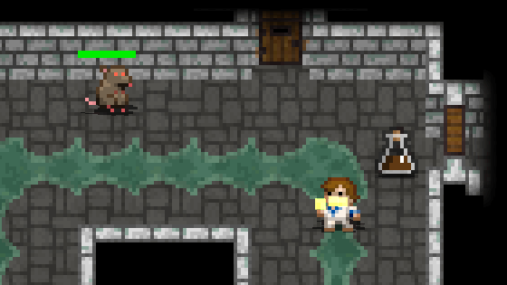
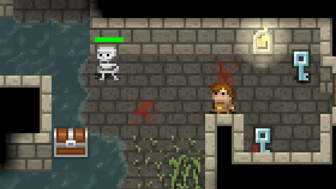
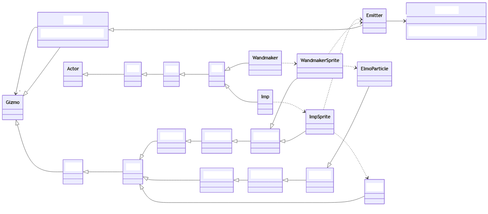

# Cvičení 07 - tvorba a život objektů

Cílem tohoto cvičení je procvičení vybraných poznatků z oblasti vytváření objektů a jejich životního cyklu.

1. Klonování třídy `BGenericList`

   - doplňte podporu pro vytváření hluboké kopie třídy `BGenericList`
     - hluboká kopie se týká samotné třídy `BGenericList`, referencovaná uživatelská data, která takový objekt obsahuje, jsou typu `T`, obecně `Object`, která není možné klonovat a tedy není to ani zde cílem
   - signatura metody musí odpovídat `public BGenericList<T> clone()`
   - vytvořte jednotkový test, kterým ověříte, že jste vytvořili nový objekt, který není tím samým objektem, ale je shodný
   - vytvořte jednotkový test, kterým ověříte, že úprava původního listu (přidání/odebrání prvku) nezmění vytvořený klon

2. Klonování třídy `BGenericList.BReadOnlyList`

     - vnořená třída `BReadOnlyList` představuje immutable verzi generic listu, doplňte podporu pro klonování i této třídy, vzhledem k její neměnnosti nevytvářejte klon, ale vraťte původní objekt
     - vytvořte jednotkový test k ověření, že klonování `BReadOnlyList` funguje správně

3. Statická tovární metoda `BList.of(...)`

     - do rozhraní `BList<T>` vytvořte statickou metodu `BList<T> of(T... values)`
     - metoda vrací neměnitelný list prvků předaných v parametrech (využijte výše uvedenou signaturu pro možnost předávání proměnného počtu parametrů)
     - vytvořte jednotkový test, který ověří, že vytvořený seznam má odpovídající prvky a je neměnitelný

4. Nakonfigurujte demonstrační DI kontejner pro logger

     - v metodě `main` projektu vytvořte DI kontejner
     - nakonfigurjte, aby kontejner poskytoval `LocalNowDateTimeProvider` pro rozhraní `DateTimeProvider` v singleton scope
     - nakonfigurujte, aby kontejner poskytoval `MemoryLoggerWithHandlers` pro rozhraní `Logger` v singleton scope, pro inicializaci poskytněte vlastní kód, který po vytvoření loggeru rovněž doplní handler `ConsoleLogMessageHandler`
     - skrze kontejner získejte instanci `Logger` a zalogujte zprávu
  
5. Analyzujte strukturu a tvorbu objektů v projektu Shattered Pixel Dungeon
    
    - viz níže

---

### 5. Analyzujte strukturu a tvorbu objektů v projektu Shattered Pixel Dungeon

- https://github.com/00-Evan/shattered-pixel-dungeon
- jedná se o počítačovou hru vytvořenou v Javě
- zajímá nás jednak objektová struktura jednotlivých entit, ale zejména jakým způsobem jsou realizovány grafické částicové efekty
  - na GIFech níže můžete vidět například odlétající částečky krve od zasažené krysy a další obdobné efekty




- v procesu analýzy si vytvářejte UML diagram tříd
  - zajímají nás především vztahy generalizace a realizace
  - asociace si zaznamenejte, pokud jsou důležité s ohledem na analyzovaný úkol

- je dobré si uvědomit, že se jedná o počítačovou hru a ty obvykle obsahují herní smyčku

```java
while (gameIsRunning()) { // pokud hra běží
    long elapsedTime = getElapsedTime();

    for (GameObject go : objects)
        go.update(elapsedTime); // aktualizuj stav všech objektů ve hře

    render(); // vykresli snímek na obrazovku

    sleepUntilNextFrame();
}
```

- ve skutečnosti je to trochu složitejší, ale princip je stejný

```java
class Game
    protected void update() {
        Game.elapsed = Game.timeScale * Gdx.graphics.getDeltaTime();
        Game.timeTotal += Game.elapsed;
        
        Game.realTime = TimeUtils.millis();

        inputHandler.processAllEvents();

        Music.INSTANCE.update();
        Sample.INSTANCE.update();
        scene.update(); // toto vede na:
        /*
        for (int i=0; i < length; i++) {
          Gizmo g = members.get( i );
          if (g != null && g.exists && g.active) {
            g.update();
          }
        }
        */
        Camera.updateAll();
    }
```

- mezi jednotlivými volánímí metod `update`, tak vždy uplyne nějaký drobný časový interval, je dobré si pamatovat, že tyto metody jsou volány často a mezi voláními plyne čas

- Vaším cílem je tedy zkusit najít a pochopit, jak vznikají objekty, které představují částicové efekty (například ta odlétávající kapka krve)

- zaměřte se na `class WandmakerSprite`
  - kde v metodě `die`
    - naleznete `emitter().start( ElmoParticle.FACTORY, 0.03f, 60 );`
  - zjistěte, kde se vezme `Emitter`
  - zjistěte, kde se vytváří objekty `ElmoParticle` a co se s nimi děje

- zaměřte se také na `class ImpSprite`
  - kde v metodě `onComplete`
    - nalezente `emitter().burst( Speck.factory( Speck.WOOL ), 15 );`
  - zjistěte, kde a jak se vytváří objekty `Speck`

- výše uvedené třídy slouží ke grafické vizualizaci, pokud byste chtěli hledat chování samotných entit, tak ty jsou v provázaných třídách `Wandmaker` a `Imp`

- pokud byste chtěli analyzovat přímo onu kapku krve, tak to úplně nedoporučuji, ale...
  - ve třídě `Char` v metodě `attack` naleznete `enemy.sprite.bloodBurstA(sprite.center(), effectiveDamage);`
  - což odkazuje na metodu `CharSprite::bloodBurstA`
  - která odkazuje na `Splash::at`
  - kde už najdete opět `Emitter::burst`

- vytvořený UML diagram přiložte ke zdrojovým kódum cvičení

- pro inspiraci je zde uveden částečný diagram zkoumaných částí kódu (bez analýzy odlétávající krve)


